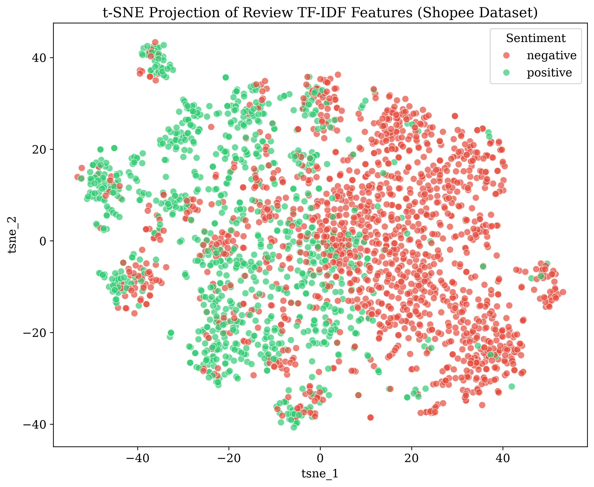
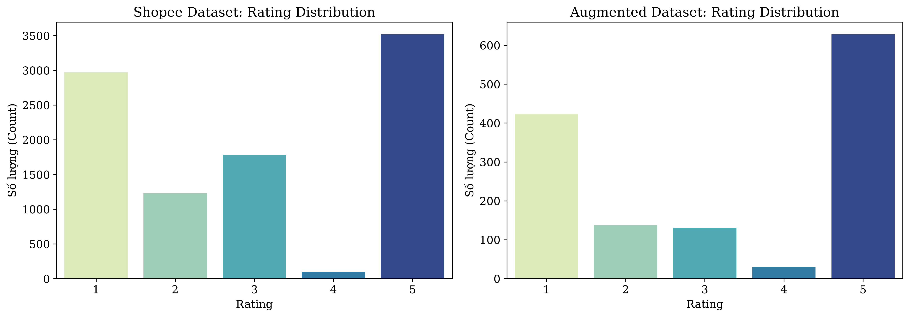
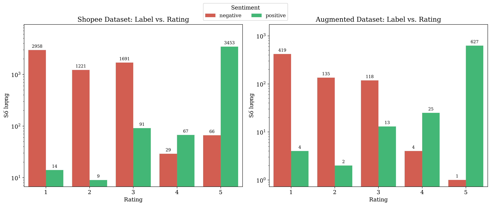
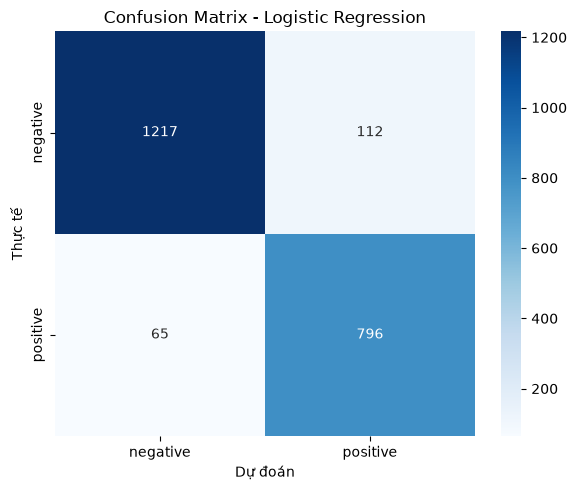
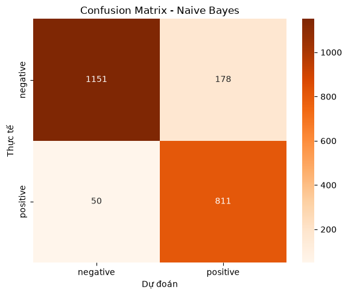
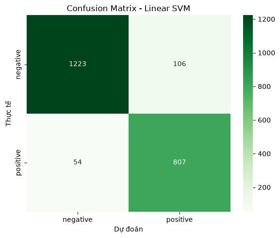
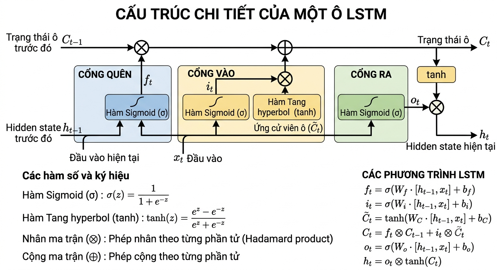
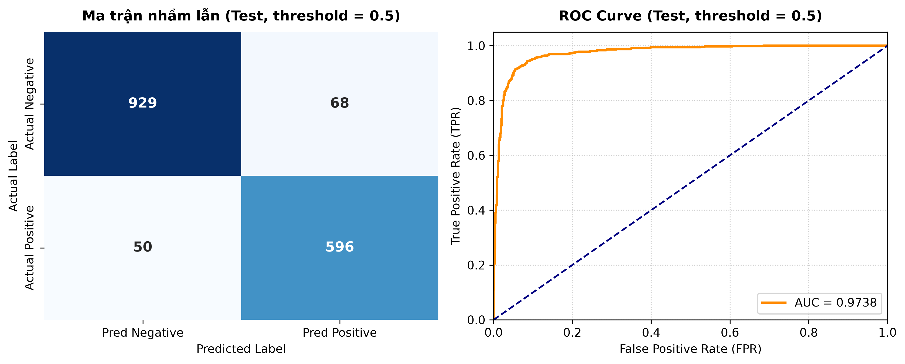
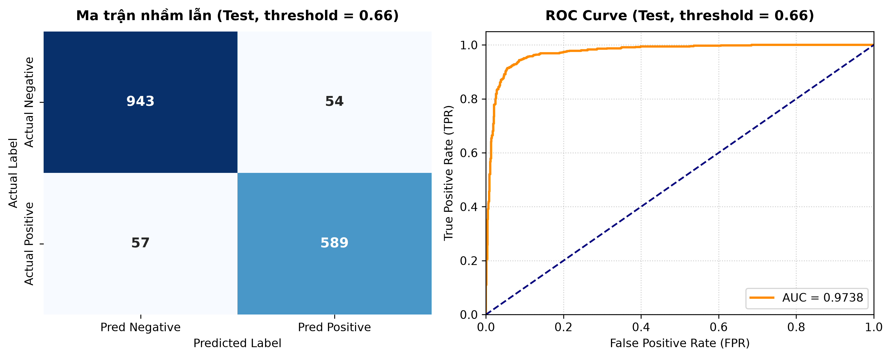

# BÁO CÁO DỰ ÁN: Ứng dụng Xử lý Ngôn ngữ Tự nhiên trong Phân tích cảm xúc khách hàng
## Thông tin Dự án

**Học phần:** Nhập môn Khoa học dữ liệu  
**Tên dự án:** Ứng dụng Xử lý Ngôn ngữ Tự nhiên trong Phân tích cảm xúc khách hàng
**Kho GitHub:** https://github.com/wangpo1009/Customer_sentiment_analysis.git

**Thành viên nhóm**

| MSSV | Họ tên | Phần việc chính | Mức độ đóng góp |
| --- | --- | --- | ---: |
| 24280027 | Lâm Nhật Tiến | Text Preprocessing, viết báo cáo | $15\%$ |
| 24280094 | Đỗ Quang Phong | Text Preprocessing, viết báo cáo | $15\%$ |
| 24280026 | Phạm Thị Diệu Thùy | Data Understanding, EDA, chỉnh sửa báo cáo | $15\%$ |
| 24280028 | Phạm Quốc Triều | Baseline Models | $14\%$ |
| 24280068 | Trương Đình Hưng | Feature Engineering | $14\%$ |
| 24280102 | Nguyễn Hoàng Sang | LSTM Model | $14\%$ |
| 24280109 | Tô Ngọc Tiến | PhoBERT Model | $13\%$ |

## MỤC LỤC

- [PHẦN 1: GIỚI THIỆU](#phần-1-giới-thiệu)
  - [1. Tổng quan dự án](#1-tổng-quan-dự-án)
  - [2. Tổng quan Tài liệu](#2-tổng-quan-tài-liệu)
  - [3. Bộ dữ liệu (Dataset)](#3-bộ-dữ-liệu-dataset)
- [PHẦN 2: XỬ LÝ DỮ LIỆU VÀ TRÍCH XUẤT ĐẶC TRƯNG](#phần-2-xử-lý-dữ-liệu-và-trích-xuất-đặc-trưng)
  - [1. Tiền xử lý dữ liệu (Data Preprocessing)](#1-tiền-xử-lý-dữ-liệu-data-preprocessing)
  - [2. Trích xuất đặc trưng (Feature Engineering)](#2-trích-xuất-đặc-trưng-feature-engineering)
- [PHẦN 3: XÂY DỰNG VÀ ĐÁNH GIÁ MÔ HÌNH](#phần-3-xây-dựng-và-đánh-giá-mô-hình)
  - [1. Các mô hình đã triển khai](#1-các-mô-hình-đã-triển-khai)
  - [2. Đánh giá và So sánh mô hình](#2-đánh-giá-và-so-sánh-mô-hình)
  - [3. Kết luận và Hướng phát triển](#3-kết-luận-và-hướng-phát-triển)
- [PHỤ LỤC](#phụ-lục)

---

## PHẦN 1: GIỚI THIỆU

### 1. Tổng quan dự án

#### 1.1. Đặt vấn đề

Trong thương mại điện tử, phản hồi của khách hàng là nguồn dữ liệu quan trọng giúp doanh nghiệp hiểu mức độ hài lòng, chất lượng sản phẩm, trải nghiệm dịch vụ và các vấn đề cần cải thiện. Tuy nhiên, khi số lượng đánh giá tăng nhanh, **việc đọc thủ công từng bình luận trở nên tốn thời gian, khó mở rộng và dễ thiếu nhất quán** giữa những người đánh giá khác nhau.

Bài toán đặt ra là xây dựng một hệ thống có khả năng **tự động phân loại cảm xúc** trong đánh giá sản phẩm tiếng Việt, cụ thể là phân loại phản hồi khách hàng thành hai nhóm chính: **Positive** và **Negative**. Với hệ thống này, doanh nghiệp có thể nhanh chóng nhận diện các phản hồi tiêu cực cần xử lý, đồng thời khai thác phản hồi tích cực để hiểu điểm mạnh của sản phẩm hoặc dịch vụ.

Dự án sử dụng các kỹ thuật **Xử lý Ngôn ngữ Tự nhiên** (Natural Language Processing - NLP), kết hợp giữa phương pháp học máy truyền thống, học sâu và mô hình ngôn ngữ tiền huấn luyện để xây dựng pipeline phân loại cảm xúc cho dữ liệu đánh giá sản phẩm Shopee tiếng Việt.

#### 1.2. Mục tiêu nghiên cứu

Dự án hướng đến các mục tiêu chính sau:

- Thu thập, tổ chức và phân tích bộ dữ liệu đánh giá sản phẩm Shopee tiếng Việt.
- Làm sạch dữ liệu văn bản, xử lý các đặc trưng nhiễu thường gặp trong đánh giá trực tuyến như emoji, ký tự lạ, lỗi chính tả, từ viết tắt và ký tự lặp.
- Thực hiện chuẩn hóa văn bản, tách từ tiếng Việt và tokenization phù hợp với từng nhóm mô hình.
- Trích xuất đặc trưng văn bản bằng các phương pháp như TF-IDF, Word2Vec và FastText.
- Xây dựng và so sánh các mô hình phân loại cảm xúc gồm Logistic Regression, Naive Bayes, Support Vector Machine, Bidirectional LSTM và PhoBERT Hybrid.
- Đánh giá mô hình bằng các chỉ số Accuracy, Precision, Recall, F1-score và phân tích ưu nhược điểm của từng hướng tiếp cận.
- Đề xuất mô hình phù hợp trong bối cảnh ứng dụng thực tế, có xét đến hiệu quả dự đoán, chi phí huấn luyện và khả năng triển khai.

#### 1.3. Phạm vi và giới hạn

Phạm vi của dự án tập trung vào bài toán phân loại cảm xúc cho đánh giá sản phẩm tiếng Việt trên nền tảng thương mại điện tử Shopee. Dữ liệu đầu vào chủ yếu gồm nội dung đánh giá, số sao và nhãn cảm xúc. Một số thử nghiệm nâng cao có sử dụng thêm metadata như số sao đánh giá và thông tin có/không có hình ảnh hoặc video.

Dự án giới hạn ở bài toán phân loại nhị phân gồm hai lớp **Positive** và **Negative**. Các sắc thái trung lập, mỉa mai, cảm xúc hỗn hợp hoặc các khía cạnh chi tiết hơn như chất lượng giao hàng, giá cả, đóng gói, chăm sóc khách hàng chưa được tách thành các nhãn riêng. Ngoài ra, kết quả mô hình phụ thuộc vào chất lượng nhãn của bộ dữ liệu; trong quá trình EDA, nhóm nhận thấy dữ liệu gốc có hiện tượng nhiễu nhãn, đặc biệt ở các mức rating trung gian.

### 2. Tổng quan Tài liệu

#### 2.1. Các nghiên cứu liên quan

Phân tích cảm xúc khách hàng là một trong những bài toán ứng dụng phổ biến của NLP. Trong các hệ thống thương mại điện tử, phân tích cảm xúc thường được dùng để tự động đánh giá thái độ của người dùng đối với sản phẩm hoặc dịch vụ. Các hướng tiếp cận thường gặp gồm:

- Phương pháp dựa trên từ điển cảm xúc, trong đó hệ thống dựa vào danh sách từ tích cực và tiêu cực để suy luận nhãn.
- Phương pháp học máy truyền thống, sử dụng đặc trưng thủ công hoặc vector hóa văn bản như Bag of Words, TF-IDF kết hợp với các mô hình Logistic Regression, Naive Bayes hoặc SVM.
- Phương pháp học sâu, sử dụng mạng nơ-ron như CNN, RNN, LSTM hoặc BiLSTM để học biểu diễn ngữ cảnh từ chuỗi token.
- Phương pháp dựa trên Transformer và mô hình ngôn ngữ tiền huấn luyện như BERT, RoBERTa, PhoBERT để khai thác biểu diễn ngữ nghĩa sâu hơn.

Trong dự án này, nhóm triển khai cả mô hình truyền thống và mô hình học sâu nhằm so sánh hiệu quả giữa các hướng tiếp cận. Các mô hình baseline dùng TF-IDF để tạo chuẩn so sánh ban đầu, trong khi LSTM và PhoBERT được sử dụng để đánh giá lợi ích của việc học ngữ cảnh và biểu diễn ngữ nghĩa.

#### 2.2. Đặc thù tiếng Việt trong NLP

Tiếng Việt có nhiều đặc điểm khiến bài toán NLP cần được xử lý cẩn thận hơn so với một số ngôn ngữ dùng khoảng trắng để phân tách từ hoàn chỉnh. Một từ tiếng Việt có thể gồm nhiều âm tiết được viết cách nhau bằng khoảng trắng, ví dụ `sản phẩm`, `tuyệt vời`, `không tốt`. Vì vậy, nếu chỉ tách token theo khoảng trắng, mô hình có thể làm mất đơn vị nghĩa thật sự của từ hoặc cụm từ.

Ngoài ra, dữ liệu đánh giá trực tuyến thường chứa nhiều hiện tượng phi chuẩn như viết tắt, thiếu dấu, sai chính tả, kéo dài ký tự để nhấn mạnh cảm xúc, emoji, icon, URL, HTML tag và dấu câu không nhất quán. Những hiện tượng này vừa chứa thông tin cảm xúc, vừa gây nhiễu cho mô hình nếu không được xử lý hợp lý.

Do đó, pipeline của dự án cần kết hợp các bước làm sạch, chuẩn hóa, tách từ tiếng Việt và tokenization. Với các mô hình truyền thống như Logistic Regression, Naive Bayes và SVM, dữ liệu cần được xử lý kỹ để giảm nhiễu trước khi trích xuất đặc trưng TF-IDF. Với các mô hình như LSTM hoặc PhoBERT, việc tiền xử lý cần cân bằng giữa loại bỏ nhiễu và giữ lại thông tin ngữ cảnh quan trọng.

#### 2.3. Các phương pháp tiếp cận hiện có

Các phương pháp được sử dụng trong dự án có thể chia thành ba nhóm:

1. **Vector hóa văn bản truyền thống:** TF-IDF biểu diễn văn bản bằng trọng số của các từ dựa trên tần suất xuất hiện trong từng văn bản và toàn bộ tập dữ liệu. Cách tiếp cận này đơn giản, dễ triển khai, có tính giải thích tương đối tốt nhưng chưa nắm bắt được thứ tự từ và quan hệ ngữ nghĩa sâu.
2. **Embedding từ:** Word2Vec và FastText học vector biểu diễn từ dựa trên ngữ cảnh. Word2Vec giúp các từ có ngữ nghĩa gần nhau nằm gần nhau trong không gian vector, còn FastText cải thiện khả năng xử lý từ hiếm, từ sai chính tả hoặc biến thể ký tự nhờ cơ chế character n-gram.
3. **Mô hình ngữ cảnh sâu:** LSTM học chuỗi token theo thứ tự và có khả năng ghi nhớ thông tin trước/sau trong văn bản, đặc biệt khi dùng Bidirectional LSTM. PhoBERT là mô hình Transformer tiền huấn luyện cho tiếng Việt, có khả năng học quan hệ ngữ cảnh phức tạp thông qua cơ chế attention.

### 3. Bộ dữ liệu (Dataset)

#### 3.1. Mô tả nguồn dữ liệu

Bộ dữ liệu gồm các đánh giá sản phẩm của khách hàng trên nền tảng Shopee và được tổ chức thành hai tập con:

| Tập dữ liệu | Mô tả |
|-------------|-------|
| **Shopee Dataset** | Tập gốc gồm hơn $9,599$ mẫu đánh giá thực tế |
| **Augmented Dataset** | Tập đã qua lọc và cân bằng nhãn, gồm $1,348$ mẫu |

Mỗi mẫu có cấu trúc bốn cột:

| Cột | Ý nghĩa |
|-----|---------|
| `id` | Khóa chính, mã định danh của đánh giá |
| `review` | Nội dung đánh giá của khách hàng |
| `rating` | Số sao khách hàng cho sản phẩm $(1$–$5)$ |
| `label` | Nhãn cảm xúc thực sự (positive / negative) |

Một số đặc điểm đáng chú ý của bộ dữ liệu gốc:

- Không có giá trị null và không có dòng trùng lặp.
- Độ dài review dao động từ 20 đến 2,021 ký tự.
- Dữ liệu chứa ký tự đặc biệt, emoji, từ sai chính tả và từ bị kéo dài ký tự.

#### 3.2. Phân tích & Khám phá dữ liệu (EDA)

Quá trình EDA tập trung vào ba nhóm phân tích chính: **phân bố nhãn**, **phân bố rating** và **khả năng phân tách đặc trưng văn bản**. Các biểu đồ dưới đây được dùng để làm rõ các nhận xét định lượng trong phần này.

**Biểu đồ 1. Không gian đặc trưng TF-IDF của tập Shopee gốc**



Biểu đồ t-SNE cho thấy hai nhóm cảm xúc **Positive** và **Negative** có xu hướng phân bố theo vùng nhưng **vẫn chồng lấn đáng kể**, đặc biệt ở khu vực trung tâm. Điều này cho thấy đặc trưng TF-IDF đã chứa tín hiệu phân biệt cảm xúc nhất định, nhưng chưa đủ mạnh để tách hai lớp thành hai cụm hoàn toàn độc lập. Với dữ liệu thực tế, hiện tượng chồng lấn này là hợp lý vì nhiều review có nội dung ngắn, dùng từ trung tính hoặc chứa cả yếu tố khen và chê trong cùng một câu.

**Biểu đồ 2. Không gian đặc trưng TF-IDF của tập dữ liệu tăng cường**


So với tập Shopee gốc, biểu đồ t-SNE của tập tăng cường cho thấy hai lớp được **phân tách rõ hơn theo trục dọc**. Nhãn **Positive** tập trung nhiều hơn ở nửa trên, trong khi nhãn **Negative** tập trung nhiều hơn ở nửa dưới. Điều này gợi ý rằng quá trình tăng cường lọc và dữ liệu đã làm giảm nhiễu và giúp mối quan hệ giữa nội dung review và nhãn cảm xúc trở nên nhất quán hơn.

**Biểu đồ 3. Phân phối nhãn cảm xúc**


Đối với tập Shopee gốc, nhãn **Negative** chiếm ưu thế với khoảng **5.965 mẫu**, trong khi nhãn **Positive** có khoảng **3.634 mẫu**. Nhóm tiêu cực chiếm khoảng $62\%$ tổng số mẫu, cho thấy **dữ liệu có mất cân bằng nhãn ở mức vừa phải**. Mức lệch này có thể khiến mô hình thiên về lớp Negative nếu không được đánh giá bằng các chỉ số theo từng lớp như Precision, Recall và F1-score. Ở tập tăng cường, số lượng hai lớp gần cân bằng hơn (**677 Negative** và **671 Positive**), giúp giảm rủi ro mô hình học lệch về một lớp.

**Biểu đồ 4. Phân phối số sao đánh giá**



Phân phối rating cho thấy dữ liệu có đặc trưng phổ biến của đánh giá thương mại điện tử: **số lượng đánh giá tập trung mạnh ở hai cực** 1 sao và 5 sao. Các mức 2, 3 và 4 sao ít hơn, phản ánh rằng khách hàng thường để lại phản hồi rõ ràng khi rất hài lòng hoặc rất không hài lòng. Tập tăng cường vẫn giữ được hình dạng phân phối tương tự tập gốc, cho thấy quá trình lấy mẫu không làm thay đổi đáng kể cấu trúc rating ban đầu.

**Biểu đồ 5. Mối quan hệ giữa rating và nhãn cảm xúc**



Biểu đồ mối quan hệ giữa rating và nhãn cho thấy tập Shopee gốc có hiện tượng ****nhiễu nhãn** *(label noise)***, đặc biệt ở các mức 3 sao và 4 sao. Một số review có rating tương đối cao nhưng vẫn mang nhãn Negative, hoặc ngược lại. Nguyên nhân có thể đến từ việc người dùng đánh giá sao không hoàn toàn nhất quán với nội dung bình luận, hoặc nội dung review chứa nhiều khía cạnh trái chiều. Ở tập tăng cường, **quan hệ giữa rating và label rõ ràng hơn**: rating thấp chủ yếu gắn với Negative, rating cao chủ yếu gắn với Positive. Đây là tín hiệu cho thấy tập tăng cường phù hợp hơn để huấn luyện mô hình phân loại nhị phân.

---

## PHẦN 2: XỬ LÝ DỮ LIỆU VÀ TRÍCH XUẤT ĐẶC TRƯNG

### 1. Tiền xử lý dữ liệu (Data Preprocessing)

Tiền xử lý dữ liệu là bước quan trọng nhằm biến văn bản thô thành dữ liệu đầu vào ổn định hơn cho mô hình. Trong dự án, nhóm chia hướng xử lý thành hai nhánh:

- **Nhánh cho mô hình baseline** như Logistic Regression, Naive Bayes và SVM: cần làm sạch và chuẩn hóa kỹ hơn để TF-IDF tạo đặc trưng ít nhiễu.
- **Nhánh cho mô hình học sâu** như LSTM và PhoBERT: cần giữ lại nhiều thông tin ngữ cảnh hơn, tránh loại bỏ quá mức các tín hiệu có thể liên quan đến cảm xúc.

#### 1.1. Làm sạch văn bản

Bước làm sạch văn bản tập trung vào việc loại bỏ những thành phần không cần thiết hoặc gây nhiễu cho mô hình. Các thao tác chính gồm:

- **Chuẩn hóa khoảng trắng:** Loại bỏ các khoảng trắng thừa, ký tự lặp không cần thiết.
- **Chuyển đổi emoji:** Thay thế các emoji phổ biến bằng các nhãn chữ (`positive_emoji`, `negative_emoji`, v.v.) để giữ lại thông tin cảm xúc mà emoji mang lại.
- **Loại bỏ nội dung không liên quan:** Xóa các URL, thẻ HTML và địa chỉ email được đính kèm trong review.

Riêng với nhánh Baseline, thêm hai bước:

- Chuyển toàn bộ văn bản về chữ thường.
- Loại bỏ dấu câu.

Sau bước này, dữ liệu văn bản trở nên nhất quán hơn, giúp **giảm kích thước từ vựng** và hạn chế việc mô hình xem các biến thể không cần thiết là những token hoàn toàn khác nhau.

#### 1.2. Chuẩn hóa văn bản

Chuẩn hóa văn bản nhằm đưa các biến thể biểu đạt về dạng thống nhất hơn. Với dữ liệu đánh giá Shopee tiếng Việt, bước này đặc biệt cần thiết vì người dùng thường viết không theo chuẩn chính tả hoặc dùng ngôn ngữ mạng xã hội.

Các thao tác chuẩn hóa gồm:

- **Chuẩn hóa từ bị kéo dài:** Các từ có từ $3$ ký tự lặp trở lên sẽ được rút gọn về $2$ ký tự (ví dụ: `đẹppppp` → `đẹpp`). Ngưỡng $3$ ký tự được chọn để tránh nhầm lẫn với các từ tiếng Anh hợp lệ như `free`, `good`, đồng thời vẫn giữ lại một phần thông tin cảm xúc mà sự lặp ký tự thể hiện.
- **Chuẩn hóa từ viết tắt và slang:** Sử dụng bảng ánh xạ các từ lóng phổ biến về dạng văn bản đầy đủ (ví dụ: `sp` → `sản phẩm`, `ok` → `được`).
- **Phục hồi từ không dấu:** Đây là bài toán khó nhất trong bước này. Phương pháp nhóm thực hiện:
    - Duyệt qua các từ trong tập dữ liệu. Với mỗi từ ta lưu lại tần suất nghĩa gốc sau đó chuyển về dạng không dấu. Ví dụ: Gặp từ `bạn` -> chuyển thành `ban`  -> đếm ` bạn` ứng với ` ban ` một lần 
    - Chọn từ có **tần suất cao nhất** trong cùng dạng. Ví dụ trong các từ `ban` thì từ `bạn` có **tần suất cao nhất** lưu lại qua `restore_map`.
    - Xử lí từng cụm. Ví dụ như `chat luong` sẽ đổi sang thành ` chất lượng `.
    - Tách câu và kiểm tra từng từ đơn, nếu từ đã có dấu thì giữ nguyên, nếu không dấu thì dò trong ` restore map ` rồi đổi.

Riêng đổi với bộ dữ liệu dành cho các mô hình baseline, ta cần loại bỏ các `stopword` để giảm noise và tăng hiệu suất lưu trữ. Bộ stopword được tải về từ link: https://stopwords.github.io/vietnamese-stopwords/ của tác giả Le Van Duyet.
Mục tiêu của bước chuẩn hóa không phải là làm mất hoàn toàn phong cách biểu đạt của người dùng, mà là giảm nhiễu để mô hình học được các mẫu cảm xúc tổng quát hơn.

#### 1.3. Tách từ tiếng Việt

Do tiếng Việt có nhiều từ đa âm tiết được viết cách nhau bằng khoảng trắng, **tách từ là bước quan trọng** trước khi vector hóa văn bản. Ví dụ, cụm `tuyệt vời` cần được xem như một đơn vị nghĩa thay vì hai token rời rạc `tuyệt` và `vời`.

Trong dự án, nhóm thử nghiệm các công cụ tách từ tiếng Việt như **Underthesea** và **PyVi**. Kết quả tách từ được sử dụng cho các bước trích xuất đặc trưng và mô hình hóa phía sau, đặc biệt là với TF-IDF và các embedding dựa trên từ.

#### 1.4. Tokenization

Nhóm sử dụng thư viện `sklearn` để tokenize và chuyển văn bản thành dạng số phục vụ các mô hình Machine Learning. Với các mô hình Deep Learning, tokenizer tương ứng của từng kiến trúc được sử dụng (PhoBERT Tokenizer của VinAI cho PhoBERT).

---

### 2. Trích xuất đặc trưng (Feature Engineering)

Sau bước tiền xử lý, dữ liệu văn bản đã được làm sạch và phân tách từ. Tuy nhiên, **các thuật toán Machine Learning không thể làm việc trực tiếp với chuỗi ký tự** mà chỉ xử lý được dữ liệu dạng số. Do đó, bước Feature Engineering được thực hiện nhằm chuyển đổi văn bản thành các vector số mang thông tin ngữ nghĩa, tạo đầu vào cho các mô hình học máy và học sâu.

#### 2.1. TF-IDF

**TF-IDF (Term Frequency - Inverse Document Frequency)** là phương pháp biểu diễn văn bản bằng trọng số của từ. Phương pháp này kết hợp hai yếu tố:

- **TF:** mức độ xuất hiện của một từ trong một văn bản.
- **IDF:** mức độ hiếm của từ đó trong toàn bộ tập dữ liệu.

Một từ xuất hiện nhiều trong một văn bản nhưng ít xuất hiện trong toàn bộ corpus sẽ có trọng số cao hơn, vì từ đó có khả năng mang thông tin phân biệt tốt hơn. Trong dự án, TF-IDF được sử dụng làm đặc trưng đầu vào cho các mô hình baseline gồm Logistic Regression, Naive Bayes và SVM.

**Ưu điểm:** Giảm ảnh hưởng của các từ phổ biến nhưng ít ý nghĩa (như `và`, `là`), cải thiện so với Bag-of-Words thuần túy.

**Hạn chế:** Không nắm bắt được quan hệ ngữ nghĩa giữa các từ (từ đồng nghĩa được biểu diễn như hai thực thể độc lập), không lưu giữ thứ tự từ, và kém hiệu quả khi mở rộng sang tập dữ liệu lớn.

#### 2.2. Word2Vec

Word2Vec học biểu diễn vector cho từng từ dựa trên ngữ cảnh xuất hiện — các từ có ngữ cảnh giống nhau sẽ có vector gần nhau trong không gian ngữ nghĩa. Mô hình huấn luyện một mạng nơ-ron nông và sử dụng lớp ẩn (embedding layer) làm vector biểu diễn. Vector câu được tạo bằng cách lấy trung bình *(Average Pooling)* các vector từ.

**Ưu điểm:** Biểu diễn được mối quan hệ ngữ nghĩa giữa các từ, giảm số chiều đặc trưng so với TF-IDF.

**Hạn chế:** Xử lý kém các từ hiếm và rất nhạy với lỗi chính tả hoặc biến thể từ. Mỗi từ chỉ có một vector duy nhất, không phân biệt được đa nghĩa theo ngữ cảnh.

#### 2.3. FastText

FastText mở rộng ý tưởng của Word2Vec bằng cách phân tích từ thành các chuỗi ký tự con *(character n-grams)*. Vector của một từ được tổng hợp từ các vector n-gram thành phần, giúp mô hình học được cấu trúc bên trong của từ.

**Ưu điểm:** Tạo vector tốt hơn cho từ hiếm và từ bị sai chính tả — một ưu điểm quan trọng với dữ liệu mạng xã hội tiếng Việt. Khắc phục được điểm yếu của Word2Vec với các biến thể từ.

**Hạn chế:** Vẫn mất thứ tự từ khi dùng trung bình vector. Không giải quyết được vấn đề đa nghĩa vì một từ vẫn chỉ tạo ra một nhóm vector.

#### 2.4. Kết quả đầu ra
Sau bước Feature Engineering, mỗi văn bản được chuyển đổi thành một vector đặc trưng có kích thước cố định. Các vector này sẽ được sử dụng làm đầu vào cho các mô hình học máy như: Logistic Regression, Naive Bayes, Support Vector Machine hoặc làm đầu vào cho các mô hình học sâu như LSTM, Transformer, PhoBERT

Nhờ đó, mô hình có thể học được các mẫu dữ liệu và thực hiện nhiệm vụ phân loại cảm xúc trên các đánh giá của khách hàng.

---

## PHẦN 3: XÂY DỰNG VÀ ĐÁNH GIÁ MÔ HÌNH

### 1. Các mô hình đã triển khai

Nhóm thử nghiệm trên tổng cộng năm mô hình, chia làm hai nhóm: 
- Nhóm Baseline (Machine Learning): Logistic Regression, SVM, Naive Bayes.
- Nhóm Deep Learning: Bidirectional LSTM, PhoBERT.

#### 1.1. Nhóm Baseline (Machine Learning)

Ở các model baseline, nhóm chỉ dùng kết quả của TF-IDF để train model, chưa dùng tới các kết quả nâng cao hơn.

**1. Logistic Regression**

Thuật toán của Logistic Regression có thể hiểu đơn giản là *dùng thuật toán Linear Regression và biến đổi đầu ra bằng hàm Sigmoid (hoặc Softmax) để đưa ra kết quả classification*. Cụ thể tuần tự các bước là:
- Khởi tạo các trọng số W
- Tính một siêu phẳng mô tả tất cả các điểm dữ liệu
- Dùng hàm sigmoid để chuyển kết quả của siêu phẳng thành một xác suất thuộc vào class nào. Vì đây là bài toán binary classification nên dùng hàm sigmoid, kết quả trả về là một giá trị xác suất **p** thuộc khoảng $[0;1]$. Cho threshold là 0.5 thì khi **$p > 0.5$, điểm dữ liệu thuộc class 1** và ngược lại 
- So sánh với label để tính loss và dùng Gradient Descent để cập nhật trọng số W
- Tiếp tục cho đến khi đạt điều kiện dừng là hàm mục tiêu hội tụ hoặc dừng sớm (chạy đủ số epoch hoặc loss đủ nhỏ)

**Kết quả đánh giá:**

**Bảng các thông số đánh giá**
| Class | Precision | Recall | F1-score |
|------|-----------|--------|----------|
| Negative | $0.95$ | $0.92$ | $0.93$ |
| Positive | $0.88$ | $0.92$ | $0.90$ |

**Ma trận nhầm lẫn**  

  

Dựa trên thuật toán của Logistic Regression và TF-IDF có thể nhận xét:

- Dù số chiều của matrix mà TF-IDF trả về là rất lớn nhưng model vẫn được train rất nhanh. Lý do là vì các vector đặc trưng phần lớn là các giá trị 0, rất thưa, nên không ảnh hưởng tốc độ tính toán của model.
- Model Logistic Regression có tính giải thích được vì kết quả trả về là một giá trị xác suất, dựa vào đó ta quyết định classify điểm dữ liệu tùy vào threshold được chọn.
- Model vẫn có các điểm yếu chưa khắc phục được từ phần trước đã nêu, đó là **không học được thứ tự từ, ngữ nghĩa và ngữ cảnh của câu**.
- Ngoài ra, do train dựa trên giả sử về mối quan hệ tuyến tính của các feature nên model không thể học các mối quan hệ phức tạp.

Tóm lại, mô hình đạt kết quả tốt, huấn luyện nhanh nhờ đặc trưng TF-IDF thưa *(sparse)*. Tuy nhiên, bị giới hạn bởi giả định tuyến tính và không học được thứ tự từ hay ngữ cảnh câu.

**2. Naive Bayes**

Thuật toán Naive Bayes hoạt động dựa trên giả sử về tính độc lập của các feature. Thuật toán xem các feature là hoàn toàn độc lập với nhau để tính xác suất có điều kiện theo định lý Bayes. Cụ thể:
- Tính xác suất xảy ra của từng class
- Tính xác suất mỗi từ xuất hiện trong từng class
- Khi predict một review, model tính xác suất có điều kiện cho class 0 và class 1. Nói cách khác, khi có các từ như trong review xuất hiện thì xác suất thuộc class 1 (hay 0) là bao nhiêu. Xác suất class nào lớn hơn thì review sẽ thuộc class đó.

**Kết quả đánh giá:**
**Bảng các thông số đánh giá**  

| Class | Precision | Recall | F1-score |
| :--- | :---: | :---: | :---: |
| negative | $0.96$ | $0.87$ | $0.91$ |
| positive | $0.82$ | $0.94$ | $0.88$ |
  
**Ma trận nhầm lẫn**  
  

Dựa trên kết quả thuật toán ta có thể có một số nhận xét:
- Đây là ****model train nhanh nhất**** trong tất cả các model mà nhóm sử dụng. Lý do là vì model không có learnable param mà chỉ là thuần tính toán các phép nhân chia.
- Các điểm về tính giải thích được và điểm yếu chưa thể khắc phục thì Naive Bayes khá giống với Logistic Regression (dù lý do đằng sau thì khác nhau).
- Ngoài ra, **việc giả định tính độc lập giữa các feature là không tốt** vì các từ thường phụ thuộc nhau để quyết định nghĩa cả câu.

Tóm lại, dây là mô hình huấn luyện nhanh nhất do không có tham số học được. Điểm yếu lớn nhất là giả định độc lập giữa các từ — một giả định không thực tế với ngôn ngữ tự nhiên, nơi các từ thường phụ thuộc nhau để tạo thành nghĩa. Qua đó kết quả thống kê đạt được trong bài toán này không tốt như hai mô hình baseline còn lại.

**3. Support Vector Machine (SVM)**

SVM cố gắng tìm một siêu phẳng để phân chia các class trong không gian dữ liệu *(decision boundary)*. Ta tìm sao cho khoảng cách từ siêu phẳng đến các điểm gần nhất của mỗi class là lớn nhất. Thuật toán cụ thể:
- Khởi tạo siêu phẳng ngẫu nhiên
- Tìm các support vector (những điểm gần đường phân chia nhất)
- Điều chỉnh siêu phẳng sao cho khoảng cách giữa siêu phẳng và các support vector là lớn nhất
- Lặp lại cho đến khi tìm được siêu phẳng tối ưu
- Khi predict một review, input vector sẽ được đưa vào phương trình của siêu phẳng. Nếu kết quả dương thì thuộc class 1, kết quả âm thì thuộc class 0.

**Kết quả đánh giá:**

**Bảng các thông số đánh giá**
| Class | Precision | Recall | F1-score |
| :--- | :---: | :---: | :---: |
| negative | $0.96$ | $0.92$ | $0.94$ |
| positive | $0.88$ | $0.94$ | $0.91$ |


**Ma trận nhầm lẫn**  
  

Dựa trên kết quả thuật toán ta có một số nhận xét:
- SVM khó giải thích hơn 2 model trên vì **nó không trả về một xác suất** thuộc vào một class.
- **Model có tính chính xác cao**, có thể là cao nhất trong 3 model baseline.
- Không học được thứ tự từ, ngữ cảnh, **train chậm khi dữ liệu lớn**.

SVM đạt kết quả tốt nhất trong nhóm Baseline. Mô hình phù hợp với không gian đặc trưng nhiều chiều như TF-IDF, nhưng khó giải thích hơn Logistic Regression vì không trả về xác suất trực tiếp, và huấn luyện chậm hơn khi dữ liệu lớn.

#### 1.2 Nhóm Deep Learning

**4. Bidirectional LSTM**

LSTM (Long Short-Term Memory) là mô hình học sâu phát triển từ kiến trúc RNN, có khả năng ghi nhớ thông tin dài hạn thông qua ba cổng: cổng quên *(Forget Gate)*, cổng đầu vào *(Input Gate)* và cổng đầu ra *(Output Gate)*. Phiên bản Bidirectional cho phép mô hình đọc chuỗi văn bản theo cả hai chiều xuôi và ngược, giúp nắm bắt ngữ cảnh toàn diện hơn.

Kiến trúc mô hình của nhóm gồm: tầng Embedding ($128$ chiều) → Bidirectional LSTM 2 lớp ($256$ units mỗi chiều) với Dropout $0.3$ → tầng Fully Connected → Sigmoid. Mô hình sử dụng hàm mất mát Binary Cross Entropy và bộ tối ưu Adam với learning rate $0.0002$.



**Kết quả huấn luyện (10 epochs):**


Thời gian huấn luyện: ${\sim}57$ giây (trên MPS).

**Kết quả trên tập kiểm thử ($2,190$ mẫu):**

| Nhãn | Precision | Recall | F1-score |
|------|-----------|--------|----------|
| Negative | $0.9362$ | $0.9391$ | $0.9376$ |
| Positive | $0.9055$ | $0.9013$ | $0.9034$ |
| **Accuracy** | | | **$92.42\%$** |

**Biểu đồ đánh giá hiệu suất mô hình:**


Nhìn chung, mô hình của nhóm làm khá tốt việc đánh giá trải nghiệm của khách hàng. Các chỉ số chung như accuracy: $92.42\%$ là khá tốt. Các chỉ số chi tiết:
  - **Precision:** Khi mô hình dự đoán một đánh giá là negative thì nó đúng $93.62\%$ số lần và khi dự đoán một đánh giá là positive thì nó đúng $90.55\%$ số lần.
  - **Recall:** Mô hình nhận diện được $93.91\%$ số câu tiêu cực dựa trên tổng số câu tiêu cực và $90.13\%$ số câu tích cực dựa trên tổng số câu tích cực
  -  **f1-score:** Điểm số của mô hình khi dự đoán cả hai khía cạnh đều khá ổn
  
Nhóm còn thực hiện **Threshold Tuning** nhằm tối ưu Recall cho lớp Negative, vì **bỏ sót đánh giá tiêu cực thường gây hại nhiều hơn** cho doanh nghiệp. Tại ngưỡng $t = 0.66$, mô hình đạt Recall cao hơn đáng kể trên lớp Negative trong khi vẫn duy trì các chỉ số còn lại ở mức chấp nhận được.

Sự thay đổi của các thông số hiệu suất sau khi tối ưu:


**5. PhoBERT Hybrid**

PhoBERT (`vinai/phobert-base`) là mô hình ngôn ngữ lớn dành riêng cho tiếng Việt, được VinAI phát triển dựa trên kiến trúc RoBERTa. Khác với LSTM xử lý văn bản tuần tự, PhoBERT sử dụng cơ chế Self-Attention của Transformer để xử lý toàn bộ các từ trong câu đồng thời, từ đó nắm bắt được các quan hệ ngữ nghĩa phức tạp giữa các từ ở xa nhau.

Để nâng cao hiệu suất, nhóm xây dựng kiến trúc lai (Hybrid) bằng cách kết hợp vector [CLS] của PhoBERT với hai đặc trưng metadata bổ trợ: số sao đánh giá (`rating_stars`) và sự xuất hiện của ảnh/video (`has_media`). Điều này giúp mô hình xử lý tốt hơn các trường hợp văn bản ngắn, mơ hồ hoặc mang tính mỉa mai.

Kiến trúc: PhoBERT Encoder → vector [CLS] ($768$ chiều) → Concatenate với metadata ($2$ chiều) → FC Layer $(770 \rightarrow 256)$ → ReLU → Dropout $0.3$ → Output (2 nhãn). Mô hình dùng hàm mất mát CrossEntropyLoss và bộ tối ưu AdamW ($lr = 2 \times 10^{-5}$, $\text{weight\_decay} = 0.01$).

**Kết quả huấn luyện (3 epochs):**

| Epoch | Train Loss | Train Acc | Val Loss | Val Acc |
|-------|------------|-----------|----------|---------|
| 1 | $0.1420$ | $95.12\%$ | $0.0980$ | $96.52\%$ |
| 2 | $0.0815$ | $97.45\%$ | $0.1042$ | $96.81\%$ |
| 3 | $0.0512$ | $98.42\%$ | $0.1115$ | $96.89\%$ |

Thời gian huấn luyện: ${\sim}246$ giây (trên MPS/CUDA).

**Kết quả trên tập kiểm thử ($2,190$ mẫu):**


| Nhãn | Precision | Recall | F1-score |
|------|-----------|--------|----------|
| Negative | $0.9715$ | $0.9768$ | $0.9741$ |
| Positive | $0.9650$ | $0.9570$ | $0.9610$ |
| **Accuracy** | | | **$96.89\%$** |### 2. Đánh giá và So sánh mô hình

Các mô hình được đánh giá trên tập kiểm thử gồm **2.190 quan sát** bằng các chỉ số Precision, Recall, F1-score và Accuracy.

### 2. Đánh giá và So sánh mô hình

#### 2.1. Bảng tổng hợp kết quả

**Nhóm Baseline (Machine Learning)**

| Mô hình | Lớp | Precision | Recall | F1-score | Accuracy ước tính |
| --- | --- | ---: | ---: | ---: | ---: |
| Logistic Regression | Negative | $0.95$ | $0.92$ | $0.93$ | ~$91.5\%$ |
| Logistic Regression | Positive | $0.88$ | $0.92$ | $0.90$ | ~$91.5\%$ |
| Naive Bayes | Negative | $0.96$ | $0.87$ | $0.91$ | ~$89.5\%$ |
| Naive Bayes | Positive | $0.82$ | $0.94$ | $0.88$ | ~$89.5\%$ |
| SVM | Negative | $0.96$ | $0.92$ | $0.94$ | ~$92.6\%$ |
| SVM | Positive | $0.88$ | $0.94$ | $0.91$ | ~$92.6\%$ |

**Nhóm Deep Learning**

| Mô hình | Lớp | Precision | Recall | F1-score | Accuracy | Thời gian huấn luyện |
| --- | --- | ---: | ---: | ---: | ---: | ---: |
| Bidirectional LSTM | Negative | $0.9362$ | $0.9391$ | $0.9376$ | $92.42\%$ | ${\sim}57$ giây |
| Bidirectional LSTM | Positive | $0.9055$ | $0.9013$ | $0.9034$ | $92.42\%$ | ${\sim}57$ giây |
| PhoBERT Hybrid | Negative | $0.9715$ | $0.9768$ | $0.9741$ | $96.89\%$ | ${\sim}246$ giây |
| PhoBERT Hybrid | Positive | $0.9650$ | $0.9570$ | $0.9610$ | $96.89\%$ | ${\sim}246$ giây |

#### 2.2. Nhận xét và phân tích

**Nhóm Baseline (Machine Learning):**
  - **Naive Bayes** là mô hình nhanh nhất do không có tham số học được, nhưng lại yếu nhất về Recall trên class Negative ($0.87$) do giả định độc lập giữa các từ là không thực tế trong ngôn ngữ tự nhiên.
  - **Logistic Regression** cân bằng tốt hơn giữa hai class, nhưng bị giới hạn bởi mối quan hệ tuyến tính giữa các đặc trưng.
  - **SVM** đạt kết quả tốt nhất trong nhóm baseline, đặc biệt F1 Negative đạt $0.94$ — điều này phù hợp với bài toán văn bản nhiều chiều, nơi SVM tỏ ra hiệu quả nhờ margin tối đa hóa.  
  
**Kết luận:** Cả ba mô hình đều đạt kết quả khá cao (89–$93\%$) dù chỉ sử dụng đặc trưng TF-IDF. Đây là dấu hiệu cho thấy bộ dữ liệu chưa thật sự phức tạp. Trong thực tế, dữ liệu NLP thường đòi hỏi các phương pháp tinh vi hơn thì kết quả mới đạt được cao như trên.

**Nhóm Deep Learning:**
  - **Bidirectional LSTM** đạt $92.42\%$ accuracy, ngang với SVM nhưng có khả năng học ngữ cảnh hai chiều — điều mà tất cả baseline đều không làm được. Thời gian huấn luyện chỉ ${\sim}57$ giây là rất nhanh với một mạng nơ-ron.
  - Mô hình tốt nhất: **PhoBERT + Metadata** với accuracy $96.89\%$, vượt trội ~$4.5\%$ so với LSTM. Tuy nhiên lại có một nhược điểm lớn là thời gian huấn luyện dài hơn nhiều (${\sim}246$ giây) và yêu cầu tài nguyên tính toán cao hơn hẳn.

### 3. Kết luận và Hướng phát triển

#### 3.1. Tổng kết kết quả

Dự án đã xây dựng thành công pipeline phân tích cảm xúc cho văn bản tiếng Việt, từ thu thập và phân tích dữ liệu, đến tiền xử lý, trích xuất đặc trưng và huấn luyện đa dạng các mô hình. Mô hình tốt nhất đạt được — PhoBERT Hybrid — cho thấy sức mạnh của các mô hình ngôn ngữ lớn được huấn luyện chuyên biệt cho tiếng Việt khi kết hợp với thông tin ngữ cảnh phi ngôn ngữ.

Xét về tính ứng dụng thực tế, với bộ dữ liệu này, nhóm cho rằng các mô hình Machine Learning truyền thống (đặc biệt là SVM) là lựa chọn hợp lý hơn cho doanh nghiệp vừa và nhỏ, vì chi phí vận hành thấp, triển khai đơn giản mà hiệu suất không chênh lệch quá nhiều. Các mô hình Deep Learning sẽ thể hiện ưu thế rõ ràng hơn khi bộ dữ liệu phức tạp, đa dạng và quy mô lớn hơn.

#### 3.2. Hạn chế

- Bộ dữ liệu còn tương đối nhỏ và đơn giản, chưa phản ánh đầy đủ độ phức tạp của ngôn ngữ tự nhiên trong thực tế.
- Các mô hình chưa được tinh chỉnh siêu tham số một cách hệ thống.
- Chưa xử lý được hoàn toàn các trường hợp văn bản mỉa mai (sarcasm) và phủ định phức tạp.
- Bộ restore_map phục hồi từ không dấu còn phụ thuộc vào tần suất trong tập dữ liệu, có thể gây sai sót với từ ít gặp.

#### 3.3. Hướng phát triển tiếp theo

- Mở rộng và làm phong phú thêm bộ dữ liệu, bao gồm dữ liệu từ nhiều nền tảng thương mại điện tử khác nhau.
- Thử nghiệm các mô hình ngôn ngữ lớn tiên tiến hơn như ViT5, BARTpho hoặc các phiên bản mới hơn của PhoBERT.
- Áp dụng các kỹ thuật tăng cường dữ liệu (data augmentation) chuyên biệt cho NLP tiếng Việt.
- Nghiên cứu bài toán phân tích cảm xúc theo từng khía cạnh *(Aspect-Based Sentiment Analysis)* để cho kết quả phân tích chi tiết và có giá trị kinh doanh cao hơn.
- Xây dựng hệ thống API để tích hợp mô hình vào quy trình phân tích dữ liệu thực tế của doanh nghiệp.

---
## PHỤ LỤC

### A. Cấu trúc thư mục dự án

```text
sentiment-analysis-vietnamese/
├── README.md
├── requirements.txt
├── data/
│   ├── raw/
│   ├── interim/
│   ├── processed/
│   └── external/
├── notebooks/
│   ├── 01_data_understanding.ipynb
│   ├── 02_eda.ipynb
│   ├── 03_text_preprocessing.ipynb
│   ├── 04_feature_engineering.ipynb
│   ├── 05_baseline_model.ipynb
│   ├── 06_svm_model.ipynb
│   ├── 07_lstm_model.ipynb
│   └── 08_phobert_finetuning.ipynb
├── src/
│   ├── data/
│   ├── preprocessing/
│   ├── features/
│   ├── models/
│   └── utils/
├── reports/
│   ├── figures/
│   ├── tables/
│   └── final_report.md
├── models/
│   ├── baseline/
│   ├── svm/
│   ├── lstm/
│   └── phobert/
└── references/
    ├── papers/
    └── notes/
```

### B. Công cụ và thư viện sử dụng

| Nhóm công việc | Công cụ/thư viện |
| --- | --- |
| Xử lý dữ liệu | pandas, numpy |
| Trực quan hóa | matplotlib, seaborn |
| Tiền xử lý văn bản | regex, underthesea, pyvi |
| Trích xuất đặc trưng | scikit-learn, Word2Vec, FastText |
| Mô hình học máy | scikit-learn |
| Mô hình học sâu | PyTorch |
| Transformer | transformers, datasets, PhoBERT |
| Đánh giá mô hình | accuracy, precision, recall, F1-score, confusion matrix |

### C. Tài liệu tham khảo

1. Nguyen, D. Q., & Nguyen, A. T. (2020). *PhoBERT: Pre-trained language models for Vietnamese*. Findings of EMNLP 2020.
2. Mikolov, T., et al. (2013). *Efficient Estimation of Word Representations in Vector Space*. ICLR 2013.
3. Joulin, A., et al. (2017). *Bag of Tricks for Efficient Text Classification*. EACL 2017.
4. Hochreiter, S., & Schmidhuber, J. (1997). *Long Short-Term Memory*. Neural Computation.
5. Bộ dữ liệu: [Shopee Vietnamese Product Reviews Sentiment](https://www.kaggle.com/datasets/dduongdev/shopee-vietnamese-product-reviews-sentiment)
6. Bộ stopword tiếng Việt: [vietnamese-stopwords](https://stopwords.github.io/vietnamese-stopwords/) — Le Van Duyet.

---

